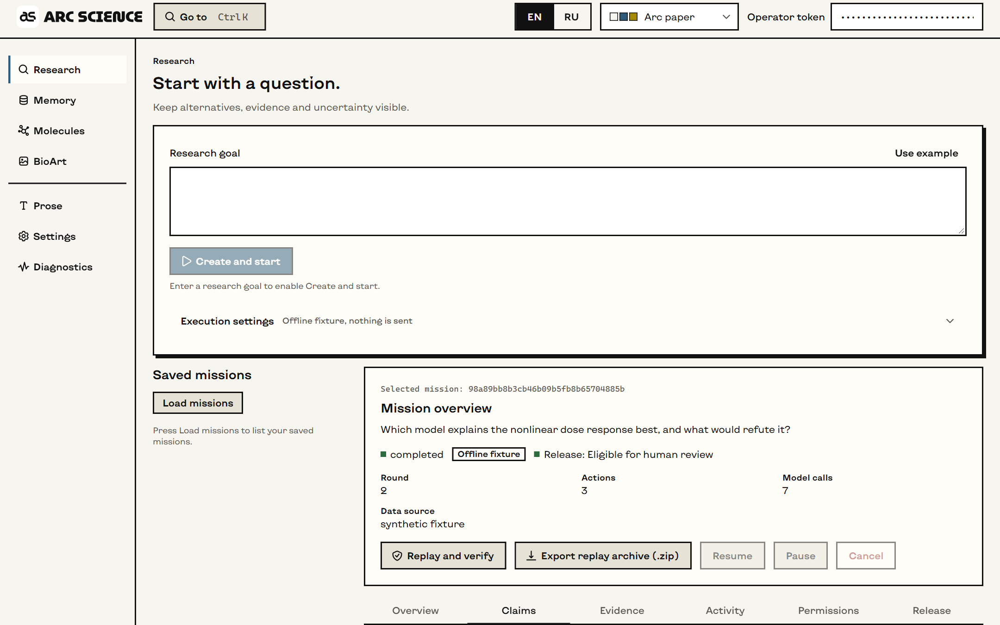
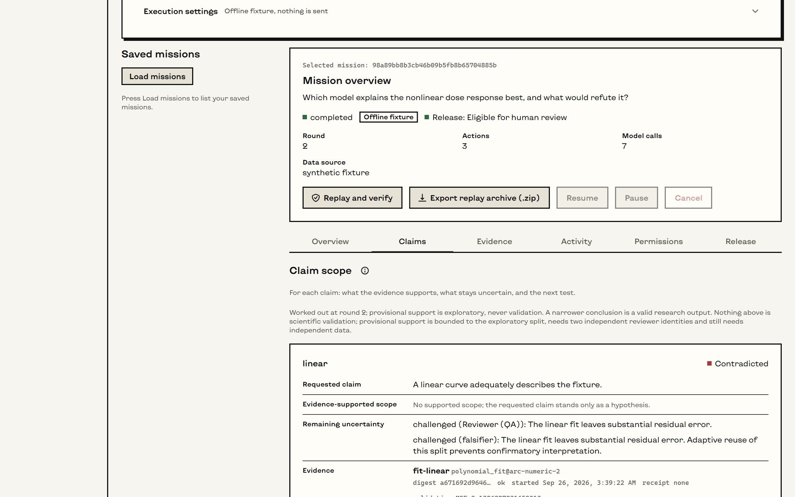
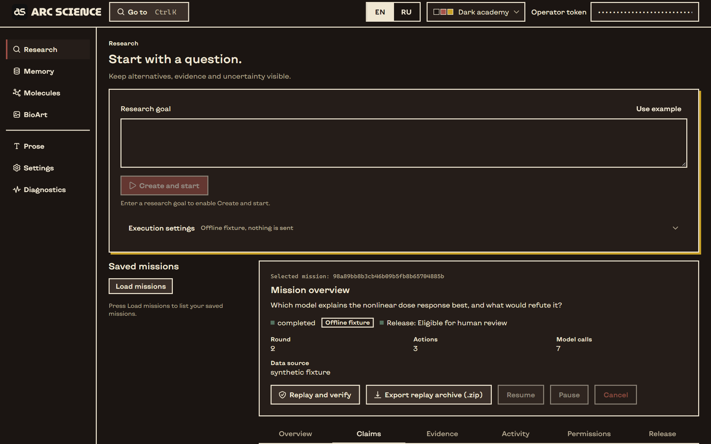

<p align="center">
  <picture>
    <source media="(prefers-color-scheme: dark)" srcset="design/logo/as/as-lockup-dark.svg">
    
  </picture>
</p>

<p align="center">A local research workbench that keeps hypotheses, evidence and uncertainty in view.</p>

<p align="center"><b>English</b> | <a href="README.ru.md">Русский</a></p>

---

Arc Science runs research missions on your own machine. A mission starts from a question,
keeps competing hypotheses side by side, runs only the computations you permit, has the
results reviewed by independent model roles, and narrows each claim to what the evidence
supports. Around it sit a molecular figure workspace (Mol* viewer and a local Blender
renderer), NIH BioArt import, session memory and a prose check.



## What it is, and what it is not

- **Local first.** The desktop app runs a private service on your machine. Nothing leaves it
  unless you approve a mission's route; every external call is recorded as a grant and a receipt.
- **Evidence, not verdicts.** A mission ends at most "eligible for human review". Model
  agreement, reproducibility and good-looking figures are not treated as validation.
- **Two languages.** The interface is in English and Russian and switches live.
- **Development software.** Version 0.6, Windows first. Linux runs the service and its tests;
  macOS is not qualified.

## Workspaces

| | |
|---|---|
| **Research** | Missions: goal, hypotheses, route and grants, timeline, claim scope, release decision, replay capsule. |
| **Memory** | Captured sessions, stored losslessly and searchable. |
| **Molecules** | Mol* viewer for local coordinate files and white-collage renders with provenance. |
| **BioArt** | NIH BioArt search, inspection and import, each network action behind its own consent. |
| **Prose** | Style diagnostics and a humane rewrite that never touches facts, numbers or citations. |
| **Settings** | Model seats and credentials, connections, connectors, appearance and language. |
| **Diagnostics** | Readiness of every seat and of the service, with the reasons. |

A mission's claims, each narrowed to what its evidence supports:



Details of each workspace are in the [guide](docs/guide.md).

## Install and run (Windows)

Requirements: Windows 10 or 11 with WebView2, Python 3.11 or newer (3.12 is tested), Rust
1.90, and Node 22 only if you rebuild the interface. Blender is optional and runs from its
own Python runtime.

```powershell
git clone https://github.com/danilkotelnikov/Arc-Science.git
cd Arc-Science\apps\arc-science
python -m pip install .
cd ..\..
.\scripts\start-arc-science.ps1 -Build
```

Then start `native\arc-desktop\target\release\Arc Science.exe`. The app keeps its workspace
under `%LOCALAPPDATA%\ArcScience`, finds Python and the `arc_science` package on first use,
opens its window at once with the readiness checks, and loads the workbench when the local
service answers. It installs nothing by itself. See the
[desktop notes](native/arc-desktop/README.md) and the [Windows port](docs/arc-science/windows-native-port-2026-09-18.md).

### Without the desktop shell

```bash
cd apps/arc-science
python -m venv .venv && . .venv/bin/activate
python -m pip install .
arc-science serve --data ./data
arc-science token --data ./data   # the operator token for the browser
```

Open http://127.0.0.1:8080/ and enter the token in the header. It stays in page memory only.

## Develop

```bash
cd apps/arc-science
python -m pip install '.[test,vector]'
python -m pytest -q -rs
cd web
npm ci
npm test          # unit and DOM tests
npm run build     # compiles the interface into the Python package
npm run e2e       # Playwright against the real service
```

Native crates: `cargo test --locked` in each folder under `native/`. The logo and icon are
generated from geometry by `scripts/build-logo.py` and `scripts/make-icon.py`
(see [design/logo](design/logo/README.md)).

## Repository

| Path | Contents |
|---|---|
| `apps/arc-science` | The Python service (FastAPI), the React workbench in `web/` (HeroUI v3, Tailwind v4), tests |
| `native/arc-desktop` | Desktop shell: WebView2 window, service supervision, credential dialog |
| `native/arc-science` | Supervisor CLI: configuration, doctor, worker |
| `native/arc-memory` | Session memory engine |
| `native/arc-svg` | SVG rasteriser used for previews and icons |
| `design` | Logo sources and fonts |
| `docs` | Guide, how-tos, the development specification and its research basis |
| `scripts` | Launcher, native acceptance scripts, logo and icon builders |

## Design

Blockprint: ink outlines, square corners and one offset shadow for the primary action of a
view, on eight switchable palettes (Dark academy below). Text is set in Kyiv Type Sans; the wordmark is
MuseoModerno Black. Components come from HeroUI v3, icons from Gravity UI.



## License

Arc Science is © 2026 Danil Kotelnikov and is licensed under
[Creative Commons Attribution-NonCommercial-ShareAlike 4.0](LICENSE) (CC BY-NC-SA 4.0).

- You may use, copy and modify it for non-commercial purposes.
- Commercial use is not permitted.
- A fork or other adaptation must credit this project (name, author and a link to
  https://github.com/danilkotelnikov/Arc-Science), say what was changed, and be shared
  under the same licence.

Third-party components keep their own licences: see
[THIRD_PARTY_NOTICES](apps/arc-science/THIRD_PARTY_NOTICES.md) and [design/fonts](design/fonts/README.md).
Copies published before 26 September 2026 were released under the MIT License and remain
available under it. Creative Commons does not recommend its licences for software; CC BY-NC-SA
was chosen deliberately for its non-commercial and share-alike terms.
