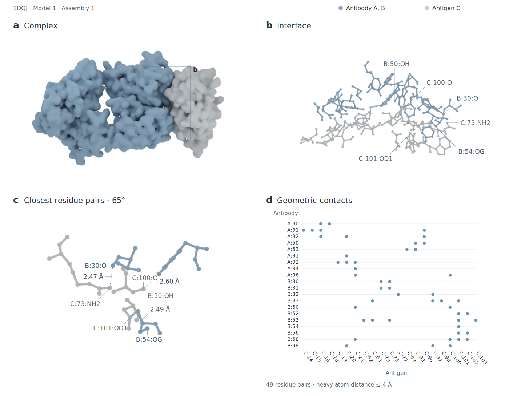

# Arc Science · development

Arc Science is an evidence-bound research workbench under development in the existing Vedix repository. It combines a molecular figure workspace with bounded research missions: competing hypotheses, permitted computations, independent role reviews and reproducible evidence.

This is a development checkpoint. The Windows-native port and native memory are
implemented; the molecular workbench now connects local coordinate files to the
existing Blender renderer. See [local rendering setup](docs/arc-science/molecular-workbench-2026-09-18.md),
[Windows port boundaries](docs/arc-science/windows-native-port-2026-09-18.md), and
[native memory qualification](docs/arc-science/native-session-memory-qualification-2026-09-16.md).
The Linux renderer executor uses a
private process-group watchdog and kernel parent-liveness pipe; deterministic tests
cover repeated native cancellation and cleanup after a successful renderer leader
exit. Independent code review approved this boundary with no remaining findings.
Historical qualification for Linux, live BioArt, macOS, and the inherited root suite
remains separately scoped. See the retained
[containment verification](docs/arc-science/renderer-containment-verification-2026-09-09.md)
and the retained [earlier record](docs/arc-science/bioart-setup-verification-2026-09-08.md).

The application is in [apps/arc-science](apps/arc-science). Vedix's plugin code, identifiers, installers and history are preserved; use the [original Vedix installation guide](docs/legacy/VEDIX_README.md) for those plugins. The repository slug has not been renamed.

Development follows [Harness-of-Harness](docs/hoh/index.md), with separate plans,
implementation and independent evaluation. The current
[release-candidate evidence](docs/hoh/2026-09-18-qualification.md) covers the native
Windows launcher, memory reliability, interactive browser flows and scientific audit.

## Windows desktop

From this repository in PowerShell, use the supervised launcher:

```powershell
.\scripts\start-arc-science.ps1 -Build
```

Later launches can omit `-Build`. Existing Python application dependencies and Rust
must be installed; the script does not install packages. It creates a native project
under `%LOCALAPPDATA%\ArcScience\workspace` only when none exists and preserves its
configuration. Use `-ProjectPath` for another workspace, `-Python` for initialization
with a specific interpreter, and `-BlenderPython` for the separate molecular runtime.
`-CheckStartup` checks readiness and supervised shutdown without opening a window.
See [desktop lifecycle and configuration](native/arc-desktop/README.md).

## Run locally

Python 3.12 is the tested application runtime. The committed UI is already compiled; Node is only needed when rebuilding it.

```bash
cd apps/arc-science
python3.12 -m venv .venv
. .venv/bin/activate
python -m pip install .
arc-science serve --data ./data
```

Open [the local workbench](http://127.0.0.1:8080/). In another activated terminal, run `arc-science token --data ./data` and enter that operator token in BioArt or Research. Both workspaces share it in page memory; it is not written to browser storage. Use a fresh data directory for 0.6.0. Historical capsules need their matching verifier. [Migration notes](apps/arc-science/docs/migration-0.6.md) describe this increment and its limits.

## Native configuration and launch

The optional Rust CLI configures and supervises the existing Python worker; it is
not a GUI or scientific rewrite. With Rust 1.90.0 installed, from the repository root:

```bash
cargo +1.90.0 build --release --locked --manifest-path native/arc-science/Cargo.toml
mkdir arc-project
native/arc-science/target/release/arc-science-native --project arc-project \
  init --python "$PWD/apps/arc-science/.venv/bin/python"
```

The selected interpreter must already contain Arc Science. Initialization writes
the path without executing it or installing dependencies, and never overwrites an
existing configuration. Then run:

```bash
native/arc-science/target/release/arc-science-native --project arc-project doctor
native/arc-science/target/release/arc-science-native --project arc-project worker -- --help
native/arc-science/target/release/arc-science-native --project arc-project serve
```

Linux native tests/build and module help are checked; this does not qualify the
scientific worker. Windows BioArt now has a native path with the weaker filesystem
and deadline guarantees documented in the Windows port record. Live NIH transfer
and macOS execution remain separate qualification gates. The supervisor is noninteractive (stdin EOF), with no
shell, PTY, or automatic install. See [native setup and lifecycle limits](native/arc-science/README.md).

## NIH BioArt assets

Use an existing project directory and install the application's `vector` extra in
your selected Python environment for SVG validation/import. Fetch defaults to SVG
and prefers an explicitly neutral-labelled representation that provides that
format. An explicit `--representation` remains authoritative; original bytes are
never recolored. From the installed application's environment:

```bash
arc-science bioart inspect 18 --project ./arc-project --allow-egress
arc-science bioart fetch 18 --project ./arc-project --allow-egress
```

After native initialization, the equivalent first-class command uses the selected
project and its configured interpreter/cache:

```bash
native/arc-science/target/release/arc-science-native --project arc-project \
  bioart fetch 18 --allow-egress
```

The HeroUI workbench now exposes the same evidence-bound path. Open BioArt, enter
the local operator token, search the fresh cache, and inspect an entry before
fetching it. Each live search, inspection, or file request requires the visible
NIH network checkbox. The permission is consumed by that one action and reset.
Cache hits do not start a network process. A cache miss with consent runs the
existing BioArt CLI from its trusted installed package in a sanitized environment
and supervised process group, then reopens and verifies the resulting cache entry
before returning it to the browser. Identical concurrent misses share one cache
population; an unrelated live miss is rejected instead of queued.

The result includes the selected file/group IDs, source and receipt paths, credit,
license and byte hash. Use `bioart verify RECEIPT` before `bioart import RECEIPT
--project ./arc-project` to import an eligible SVG. Omit `--allow-egress` for
verified fresh-cache access only. AI/EPS are archive-only, and PNG is preview-only.
Automation currently accepts exact Public Domain entries, not every license in
the collection. Live entry 18 SVG transfer, receipt verification and original download
were exercised on Windows. That NIH SVG remains download-only under the strict import
validator; broad NIH vector import and browser-rendered keyword search remain unqualified.
See [provider behavior](apps/arc-science/docs/bioart.md) and the separate
[access/setup research](docs/arc-science/bioart-setup-research-2026-09-08.md).

## Molecular workspace



The default is frozen candidate 03: HyHEL-63 Fab author chains A+B with lysozyme C, RCSB 1DQJ, model 1, identity biological assembly 1. The original collage and annotated full-complex/interface/rotated SVG views support real zoom and export. Native transparent PNG views are separate **unlabeled** downloads.

The complete CSV contains 49 residue pairs at minimum heavy-atom distance ≤4 Å. This geometric criterion does not establish hydrogen bonds, affinity or energetic hotspots. The surface is an approximate Gaussian atomic envelope, not a solvent-excluded surface; the rotated detail shows only the three nearest pairs.

Public downloads include coordinates, scene specification, captured worker and integrity/review metadata. Large editable `.blend` scenes remain in the separately delivered bundle. The authenticated **Render your structure locally** panel accepts coordinate files, tracks a bounded render job, and provides its white collage and provenance downloads. Set the server's Blender runtime as described in [local rendering setup](docs/arc-science/molecular-workbench-2026-09-18.md).

To render your own authorized coordinates, install `'.[structure]'` in the app environment and prepare a **separate** Blender Python runtime using [the rendering setup](apps/arc-science/docs/vector-rendering.md) and [the historical Blender lock](apps/arc-science/requirements-blender.lock). Then:

```bash
arc-science molecule-render source.cif --antibody A,B --antigen C \
  --assembly 1 --output ./new-candidate \
  --blender-python /path/to/blender-env/bin/python
```

Defaults are a 1400 px white collage, 96 samples and seed 23. The output directory must not already exist. Reproduction requires the specified renderer environment; this migration does not claim a new Blender qualification.

## Research and limits

Research preserves goal, execution mode, round limit, explicit egress and visual-review consent, saved missions, start/cancel/resume, numerical verification and replay-capsule export. Artifact inspection/download remains authenticated. Switching workspaces retains the current goal, token and mission.

Offline mode uses a scripted planner and real numerical analysis; it is not live-model or biological evidence. Live mode requires configured server-side providers, exact model IDs and credentials. Visual review also requires a configured vision provider; missing or failed qualification is not a passing badge. [Provider configuration](apps/arc-science/docs/source-readme-0.4.md#direct-model-and-vision-configuration) documents the retained environment settings; substitute a fresh 0.6 data directory.

HoH's fixed roles, single writer, frozen candidates and independent QA are the foundation. Self-evolving harness proposals, broader scientific composition and Lean proof obligations remain separate development requirements. Reproducibility, model agreement and attractive figures do not establish scientific validity or publication authorization.

The React/HeroUI 3 UI is built and tested through DOM interactions and served artifact bytes. On 18 September 2026 the local browser displayed the molecular workbench, authenticated renderer readiness, restored job history and a newly generated collage. [Current qualification](docs/arc-science/molecular-workbench-qualification-2026-09-18.md) distinguishes these checks from historical illustration acceptance and untested workflows.

## Develop and test

```bash
cd apps/arc-science
python -m pip install '.[test,vector]'
cd web
npm ci
npm test
npm run build
cd ..
python -m pytest -q -rs
python -m pip wheel --no-deps . --wheel-dir dist
```

`npm run build` copies compiled files into the Python package. Path-scoped CI runs the app tests, real frontend DOM tests and production build. Native Blender integration tests skip unless an explicit runtime is supplied; ordinary CI does not call live models or paid services.

[Application migration and public inclusion policy](apps/arc-science/docs/migration-0.6.md) · [Legacy Vedix guide](docs/legacy/VEDIX_README.md)
