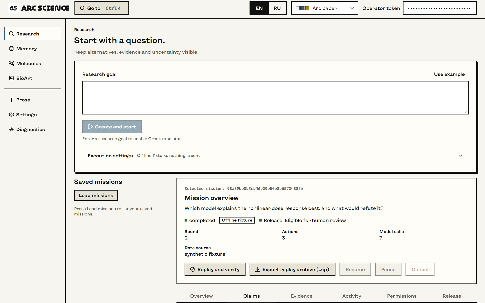
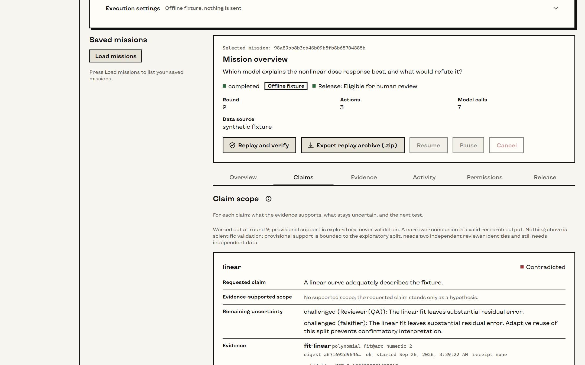

<p align="center">
  <picture>
    <source media="(prefers-color-scheme: dark)" srcset="design/logo/as/as-lockup-dark.svg">
    
  </picture>
</p>

<p align="center">A local research workbench that keeps hypotheses, evidence and uncertainty in view.</p>

<p align="center"><b>English</b> | <a href="README.ru.md">Русский</a></p>

---

Arc Science runs research missions on your own machine. A mission starts from a question,
keeps competing hypotheses side by side, runs only the computations you permit, has the
results reviewed by independent model roles, and narrows each claim to what the evidence
supports. Around it sit a molecular figure workspace (Mol* viewer and a local Blender
renderer), NIH BioArt import, session memory and a prose check.



## What it is, and what it is not

- **Local first.** The desktop app runs a private service on your machine. Nothing leaves it
  unless you approve a mission's route or confirm a single call; every external call is recorded
  as a grant and a receipt. Through the service API, a single-call confirmation can also be
  remembered for 30 days as a grant you can revoke.
- **Evidence, not verdicts.** A mission ends at most "eligible for human review". Model
  agreement, reproducibility and good-looking figures are not treated as validation.
- **Two languages.** The interface is in English and Russian and switches live.
- **Development software.** Version 0.6, Windows first. Linux runs the service and its tests;
  macOS is not qualified.

## Workspaces

| | |
|---|---|
| **Research** | Missions: goal, hypotheses, route and grants, timeline, claim scope, release decision, replay capsule. |
| **Memory** | Captured sessions, stored losslessly and searchable. |
| **Molecules** | Mol* viewer for local coordinate files and white-collage renders with provenance. |
| **BioArt** | NIH BioArt search, inspection and import, each network action behind its own consent. |
| **Prose** | Style diagnostics and a humane rewrite that never touches facts, numbers or citations. |
| **Settings** | Model seats and credentials, connections, connectors, appearance and language. |
| **Diagnostics** | Readiness of every seat and of the service, with the reasons. |

A mission's claims, each narrowed to what its evidence supports:



Details of each workspace are in the [guide](docs/guide.md).

## Recent work (September 2026)

Most of this month's work is the service side of a new agentic research session. It is
available through the service API and covered by tests. The session interface that will show
it, a three-pane session with a decision map, is still being built, so unless a line says
otherwise, none of the following is visible in the current workbench.

### Research missions you can steer

- **Decide after every plan.** With `gate: "each_round"` a mission pauses after each committed
  plan, including one that proposes to stop. You answer per branch or for the whole plan with
  `pursue`, `park`, `drop` or `request_test`, with an optional note, through
  `POST /api/missions/{id}/decisions`. Parked and dropped branches have their actions withheld.
  Decisions go into the next planner prompt, never to the reviewers, and never change a claim's
  status. Each decision is sealed into the evidence record and checked again at verification.
- **Read the mission as a tree.** `GET /api/missions/{id}/tree` returns plans, branches,
  actions, observations, decisions and stops laid out by round. It is derived on read and is
  not evidence. `GET /api/missions/{id}/timeline?after=<seq>` returns only the newer rows.
- **Continue a finished mission.** A new mission names the finished one in `continues`, and
  the earlier mission's supported scope becomes its first context item.
- **Pick the crew.** A mission can set its own model and effort for each role (planner,
  reviewer, falsifier, vision) on top of the Settings seats. The approved route covers the crew.
- **Attach earlier work.** Memory records and prior missions can be attached as context, up to
  50 records, 5 missions and 24,000 characters, and previewed first with
  `POST /api/missions/context/preview`. The planner receives it marked as evidence to weigh, not
  as instructions, and it never grants permission. The reviewers see only memory records a
  person wrote; prior missions and memory a mission wrote go to the planner alone, so the
  reviewers' support stays independent of that earlier verdict.
- **Set budgets.** `max_tokens`, `max_cost_usd` and `max_minutes` stop a mission with
  `token_limit`, `cost_limit` or `time_limit`. When a model call does not report its token
  usage, the mission stops as `budget_unmeasurable`. The mission reports what it spent: tokens, cost,
  calls and minutes. Spend is checked before each model step, so a mission can overrun its
  budget by one step. A cost budget needs seats that report cost, which today means Claude
  Code CLI seats.
- **Coded refusals and stops.** Every refusal from the mission, grant, consent, prose,
  settings, probe, memory and BioArt routes is `{code, detail, facts}` with a code from one
  registry, `ERROR_CODES` in `error_codes.py` (the Molecules render routes still answer in
  English only). Every stop records a `stop_code` from `STOP_CODES` with its facts, so an
  interface can show them in any language without parsing English.
- **Missions from the previous release keep working.** They keep their digests and still
  resume, export and verify.

### Evidence and the validation ladder

Each claim now carries a rung from L0 to L5, worked out only from recorded evidence. A rung
counts only when every rung below it holds, and agreement between model seats never raises one.

| Rung | What it needs |
|---|---|
| **L0** | Nothing: the claim is asserted. |
| **L1** | Every number, source and name is a reference that resolves. Each observation is in the event log, an external read has its receipt, the observation ran the action the plan asked for on the frozen dataset, and no cited work is retracted or unchecked. |
| **L2** | A passed replay verification, and every referenced number comes from a tool that can be replayed. |
| **L3** | A measurable falsifier (tool, metric, threshold, direction) committed before any numerical observation of the dataset. |
| **L4** | The falsifier survived every measurement, and a permutation-control null model rejects at alpha 0.05. |
| **L5** | External replication. Not built; always reported as still needed. |

- **References instead of prose.** In new missions a claim writes each number as
  `{{observation.field}}`, cites a literature search as `{{observation}}` and marks an
  identifier with digits as `{{name:X}}`. Nothing in the prose is parsed for meaning. A numeral
  typed outside a reference, in any script, keeps the claim below L1.
- **Names come from the study.** A name resolves only when the exact word appears in the
  study's own vocabulary: the goal, the context records you chose (not prior missions or memory
  a model wrote), your decision notes and the data of successful observations, except strings
  that repeat the action's own arguments. Text written by a model adds no names. Recorded free
  text such as an abstract can hold words with a unit in them (24h, 10mg); these then count as
  names and are shown with where the study recorded them.
- **Retraction check.** A literature search asks OpenAlex whether each returned work is
  retracted, under its own grant and receipt.
- **Release holds claims to a rung.** The release decision has a `claim_rungs` check: L2 for a
  claim that rests on numbers, L1 for the others. A defect in the evidence fails the check; a
  step not yet taken, such as verification, leaves the check unknown. Either way the release
  stays blocked until the claim reaches its rung. Missions from the previous release still show
  the ladder; for their export only the reference syntax is waived, and the release reason says
  that their numbers are not traced.
- **What the workbench shows.** Claim cards in the current Research workspace render the
  references with their diagnostics and mark the text that falls outside the ladder's
  guarantee. The rung, its needs and the `claim_rungs` check are not shown yet.

A rung says how far a claim has been traced and tested, never that it is true. The ladder does
not check the words around a reference, such as units.

### Memory, network and BioArt

- **Remembered consent.** A seat probe, a prose humanise request, third-party detection and
  live BioArt reads accept `remember_days: 30` together with the consent flag. That creates one
  revocable grant per destination and data category; each later use writes a receipt, and a
  newer remembered grant replaces the earlier one. Missions never borrow it.
- **System proxy.** Every outbound request (model seats, readiness probes, prose detection,
  BioRender discovery, MCP HTTP tools, mission reads, BioArt) goes through the system proxy,
  taken from the `*_PROXY` variables or the Windows Internet Options. `NO_PROXY` and the
  Windows bypass list are honoured, and loopback stays direct. A SOCKS proxy is refused with a
  message asking you to switch it to HTTP mode.
- **BioArt works again.** Search uses NIH's current `discoverSearch` Server Action, whose id is
  looked up at run time. Files that NIH serves without a content type are identified by their
  bytes, AI files are imported as PDF only when the PDF importer accepts them, and SVG preview
  is decided apart from import. The BioArt workspace already uses the repaired search, preview
  and AI import; thumbnails and coded BioArt errors are in the API only.
- **Memory statistics.** `GET /api/memory/stats` reports the on-disk size of the database and
  its WAL file, raw and compressed text sizes, record counts and whether the full-text index is in
  sync with the records. Session rows carry a title and the time of the last capture, and memory errors name
  their cause, so a damaged record reads as `memory.record_corrupt`. The Memory workspace does
  not show these yet.

### Tests

- Ten offline journey tests, J0 to J9, in `apps/arc-science/tests/test_session_journey.py`
  drive the new session through the API with demo agents, in the order an operator would:
  an automatic run, pausing for decisions, dropping a branch, budgets, continuing a finished
  mission with attached context, a crew, coded refusals, missions from the previous release,
  remembered consent for BioArt, and the ladder.
- Fourteen new Python test files add 450 tests, and 1447 tests are collected in all. The last
  full run, recorded with commit ff9e20e, passed 1376 and skipped 71. The memory engine gained 8
  Rust tests.

### Reworked

- **Regex number binding, replaced by references.** The first ladder matched numbers in claim
  prose to recorded fields with regular expressions and scanned the text for DOIs and PMIDs.
  Across ten commits of fixes, reviews kept finding wordings it misread (ranges, units,
  statistics, non-ASCII names), so it was deleted with its tests in favour of the reference syntax.
- **Names on trust, replaced by the study's vocabulary.** The first reference version accepted
  any `{{name:X}}`, which let any text with digits past the numeral check. A name now has to
  come from the study, its origin is recorded, and names in any script, such as TGF-β1, are
  accepted.
- **Branch-only references and numbers that could not be replayed.** References resolved only
  on the claim's own branch, and a search hit count could reach L2. They now resolve across the
  mission, and a number that cannot be replayed is a permanent defect.
- **Previous-release missions outside the check.** They skipped the rung check. They are now checked with only the reference syntax waived, and the release no longer
  claims a guarantee they do not meet.
- **Stacked remembered grants.** Several remembered grants could exist at once, so revoking the
  one you saw fell back to an older one, and a refused call could still leave a grant behind.
  Now a new remembered grant supersedes the old one in the same transaction, the grant is written only
  when the request is sent, and probe consent is tied to the real endpoint or executable.
- **Gate after the stop.** A plan that proposed to stop ended a gated mission without asking.
  Every committed plan now waits for your decision.
- **One tree node per action.** An action parked in one round and pursued in a later one needs
  a node and an outcome per round, so the tree now draws one action node per plan.
- **Unrecorded spend.** Rejected and failed model calls did not count toward the budget, and
  time while the service was down counted as run time. Both are counted correctly now.
- **Clients without a proxy.** BioArt, the CLI helper, prose detection and MCP HTTP clients
  ignored the system proxy, and on the developer's machine NIH is reachable only through it.
  The shared client now routes each request by its own URL, so bypass hosts stay direct, and BioArt
  child processes inherit the parent's proxy decision.
- **Errors matched by English text.** The interface localises refusals by parsing English;
  the codes let the new session interface stop doing that. Memory errors were all reported as read-budget failures and now name
  their real cause, and the database size no longer counts WAL pages twice.
- **EPS guessed from text.** Successive text heuristics for NIH's DOS EPS header either let
  HTML through or refused real files. A DOS EPS header that starts with its magic number is now
  read field by field, and its sections are bounded by the file size.
- **Tests that skipped quietly.** SVG tests skipped without a rasterizer, and memory tests
  skipped in CI because the worker was never built. Both now fail with a named cause, CI builds
  the worker first, and the worker reports a digest of its sources so a stale build is refused.

## Install and run (Windows)

Requirements: Windows 10 or 11 with WebView2, Python 3.11 or newer (3.12 is tested), Rust
1.90, and Node 22 only if you rebuild the interface. Blender is optional and runs from its
own Python runtime.

```powershell
git clone https://github.com/danilkotelnikov/Arc-Science.git
cd Arc-Science\apps\arc-science
python -m pip install .
cd ..\..
.\scripts\start-arc-science.ps1 -Build
```

Then start `native\arc-desktop\target\release\Arc Science.exe`. The app keeps its workspace
under `%LOCALAPPDATA%\ArcScience`, finds Python and the `arc_science` package on first use,
opens its window at once with the readiness checks, and loads the workbench when the local
service answers. It installs nothing by itself. See the
[desktop notes](native/arc-desktop/README.md) and the [Windows port](docs/arc-science/windows-native-port-2026-09-18.md).

### Without the desktop shell

```bash
cd apps/arc-science
python -m venv .venv && . .venv/bin/activate
python -m pip install .
arc-science serve --data ./data
arc-science token --data ./data   # the operator token for the browser
```

Open http://127.0.0.1:8080/ and enter the token in the header. It stays in page memory only.

## Develop

```bash
cargo build --release --locked --manifest-path native/arc-svg/Cargo.toml     # SVG rasterizer for the tests
cargo build --release --locked --manifest-path native/arc-memory/Cargo.toml  # memory worker
cd apps/arc-science
python -m pip install '.[test,vector]'
python -m pytest -q -rs
cd web
npm ci
npm test          # unit and DOM tests
npm run build     # compiles the interface into the Python package
npm run e2e       # Playwright against the real service
```

Tests that render SVG fail, not skip, when no rasterizer is found. On Windows they pick up
`arc-svg2png.exe` from the build above; elsewhere set `ARC_SVG2PNG` or install Cairo. The
memory worker tests skip locally when the worker is not built; under CI they need
`ARC_MEMORY_WORKER` and fail without it.

Native crates: `cargo test --locked` in each folder under `native/`. The logo and icon are
generated from geometry by `scripts/build-logo.py` and `scripts/make-icon.py`
(see [design/logo](design/logo/README.md)).

## Repository

| Path | Contents |
|---|---|
| `apps/arc-science` | The Python service (FastAPI), the React workbench in `web/` (HeroUI v3, Tailwind v4), tests |
| `native/arc-desktop` | Desktop shell: WebView2 window, service supervision, credential dialog |
| `native/arc-science` | Supervisor CLI: configuration, doctor, worker |
| `native/arc-memory` | Session memory engine |
| `native/arc-svg` | SVG rasteriser used for previews and icons |
| `design` | Logo sources and fonts |
| `docs` | Guide, how-tos, the development specification and its research basis |
| `scripts` | Launcher, native acceptance scripts, logo and icon builders |

## Design

Blockprint: ink outlines, square corners and one offset shadow for the primary action of a
view, on eight switchable palettes (Dark academy below). Text is set in Kyiv Type Sans; the wordmark is
MuseoModerno Black. Components come from HeroUI v3, icons from Gravity UI.


## License

Arc Science is © 2026 Danil Kotelnikov and is licensed under
[Creative Commons Attribution-NonCommercial-ShareAlike 4.0](LICENSE) (CC BY-NC-SA 4.0).

- You may use, copy and modify it for non-commercial purposes.
- Commercial use is not permitted.
- A fork or other adaptation must credit this project (name, author and a link to
  https://github.com/danilkotelnikov/Arc-Science), say what was changed, and be shared
  under the same licence.

Third-party components keep their own licences: see
[THIRD_PARTY_NOTICES](apps/arc-science/THIRD_PARTY_NOTICES.md) and [design/fonts](design/fonts/README.md).
Copies published before 26 September 2026 were released under the MIT License and remain
available under it. Creative Commons does not recommend its licences for software; CC BY-NC-SA
was chosen deliberately for its non-commercial and share-alike terms.
