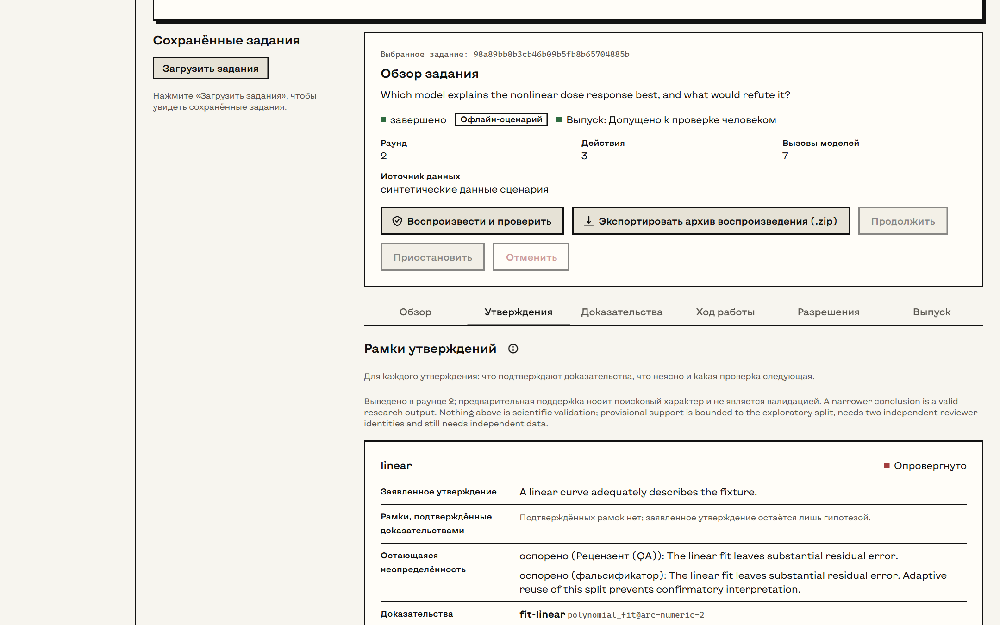

<p align="center">
  <picture>
    <source media="(prefers-color-scheme: dark)" srcset="design/logo/as/as-lockup-dark.svg">
    
  </picture>
</p>

<p align="center">Локальная исследовательская среда, в которой гипотезы, доказательства и неопределённость остаются на виду.</p>

<p align="center"><a href="README.md">English</a> | <b>Русский</b></p>

---

Arc Science ведёт исследовательские задания на вашем компьютере. Задание начинается с вопроса,
держит конкурирующие гипотезы рядом, выполняет только разрешённые вами вычисления, передаёт
результаты на проверку независимым ролям моделей и сужает каждое утверждение до того, что
подтверждают доказательства. Вокруг этого ядра — работа с молекулярными иллюстрациями
(просмотрщик Mol* и локальный рендер в Blender), импорт из NIH BioArt, память сеансов и проверка текста.



## Что это и чем это не является

- **Всё локально.** Настольное приложение запускает закрытую службу на вашем компьютере. Данные
  не уходят наружу, пока вы не одобрите маршрут задания; каждый внешний вызов записывается как
  разрешение и квитанция.
- **Доказательства, а не вердикты.** В лучшем случае задание завершается статусом «можно передать
  на проверку человеку». Согласие моделей, воспроизводимость и красивые иллюстрации не считаются
  подтверждением.
- **Два языка.** Интерфейс на английском и русском, язык переключается сразу.
- **Программа в разработке.** Версия 0.6, в первую очередь для Windows. На Linux работают служба
  и её тесты; macOS не проверялась.

## Рабочие области

| | |
|---|---|
| **Исследование** | Задания: цель, гипотезы, маршрут и разрешения, хронология, область утверждений, решение о выпуске, капсула для воспроизведения. |
| **Память** | Сохранённые сеансы без потерь и поиск по ним. |
| **Молекулы** | Просмотр локальных файлов координат в Mol* и рендер белых коллажей с происхождением данных. |
| **BioArt** | Поиск, просмотр и импорт из NIH BioArt; каждое сетевое действие требует отдельного согласия. |
| **Текст** | Стилистическая диагностика и бережная правка, которая не трогает факты, числа и ссылки. |
| **Настройки** | Модели ролей и учётные данные, подключения, коннекторы, оформление и язык. |
| **Диагностика** | Готовность каждого места и самой службы с объяснением причин. |

Подробное описание каждой области — в [руководстве](docs/guide.md) (на английском).

## Установка и запуск (Windows)

Нужны Windows 10 или 11 с WebView2, Python 3.11 или новее (проверен 3.12), Rust 1.90 и Node 22 —
только если вы пересобираете интерфейс. Blender необязателен и работает в собственной среде Python.

```powershell
git clone https://github.com/danilkotelnikov/Arc-Science.git
cd Arc-Science\apps\arc-science
python -m pip install .
cd ..\..
.\scripts\start-arc-science.ps1 -Build
```

Затем запустите `native\arc-desktop\target\release\Arc Science.exe`. Приложение хранит рабочую
папку в `%LOCALAPPDATA%\ArcScience`, при первом запуске находит Python и пакет `arc_science`,
сразу открывает окно с проверками готовности и загружает рабочую среду, когда ответит локальная
служба. Само оно ничего не устанавливает. Подробности — в [заметках о настольном приложении](native/arc-desktop/README.md)
и [описании переноса на Windows](docs/arc-science/windows-native-port-2026-09-18.md).

### Без настольной оболочки

```bash
cd apps/arc-science
python -m venv .venv && . .venv/bin/activate
python -m pip install .
arc-science serve --data ./data
arc-science token --data ./data   # токен оператора для браузера
```

Откройте http://127.0.0.1:8080/ и введите токен в шапке. Он хранится только в памяти страницы.

## Разработка

```bash
cd apps/arc-science
python -m pip install '.[test,vector]'
python -m pytest -q -rs
cd web
npm ci
npm test          # модульные тесты и тесты DOM
npm run build     # собирает интерфейс в пакет Python
npm run e2e       # Playwright против настоящей службы
```

Нативные модули: `cargo test --locked` в каждой папке внутри `native/`. Логотип и значок строятся
из геометрии скриптами `scripts/build-logo.py` и `scripts/make-icon.py`
(см. [design/logo](design/logo/README.md)).

## Структура репозитория

| Путь | Содержимое |
|---|---|
| `apps/arc-science` | Служба на Python (FastAPI), рабочая среда на React в `web/` (HeroUI v3, Tailwind v4), тесты |
| `native/arc-desktop` | Настольная оболочка: окно WebView2, управление службой, диалог учётных данных |
| `native/arc-science` | Управляющая утилита: настройка, проверка, запуск обработчика |
| `native/arc-memory` | Движок памяти сеансов |
| `native/arc-svg` | Растеризатор SVG для превью и значков |
| `design` | Исходники логотипа и шрифты |
| `docs` | Руководство, инструкции, спецификация разработки и её исследовательская основа |
| `scripts` | Запуск, проверки нативных сборок, построение логотипа и значка |

## Оформление

Blockprint: чернильные контуры, прямые углы и одна смещённая тень у главного действия экрана,
восемь переключаемых палитр. Текст набран шрифтом Kyiv Type Sans, логотип — MuseoModerno Black.
Компоненты — HeroUI v3, значки — Gravity UI.

## Лицензия

Arc Science © 2026 Danil Kotelnikov. Распространяется по лицензии
[Creative Commons «Атрибуция — Некоммерческое использование — На тех же условиях» 4.0](LICENSE) (CC BY-NC-SA 4.0).

- Проект можно использовать, копировать и изменять в некоммерческих целях.
- Коммерческое использование запрещено.
- Форк или иная переработка должны указывать на этот проект (название, автора и ссылку
  https://github.com/danilkotelnikov/Arc-Science), сообщать, что изменено, и распространяться
  на тех же условиях.

Сторонние компоненты сохраняют собственные лицензии: см.
[THIRD_PARTY_NOTICES](apps/arc-science/THIRD_PARTY_NOTICES.md) и [design/fonts](design/fonts/README.md).
Копии, опубликованные до 26 сентября 2026 года, выпускались под лицензией MIT и остаются доступны
на её условиях. Creative Commons не рекомендует свои лицензии для программ; CC BY-NC-SA выбрана
сознательно — ради условий о некоммерческом использовании и распространении на тех же условиях.
