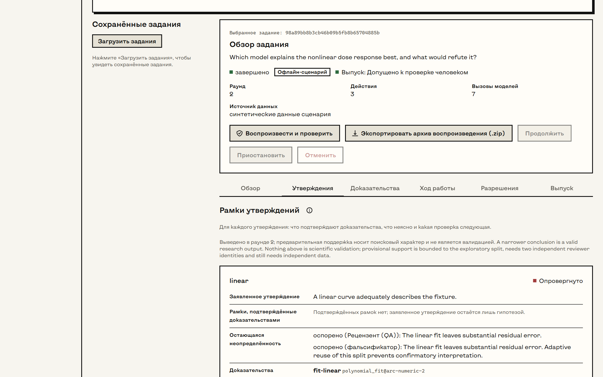
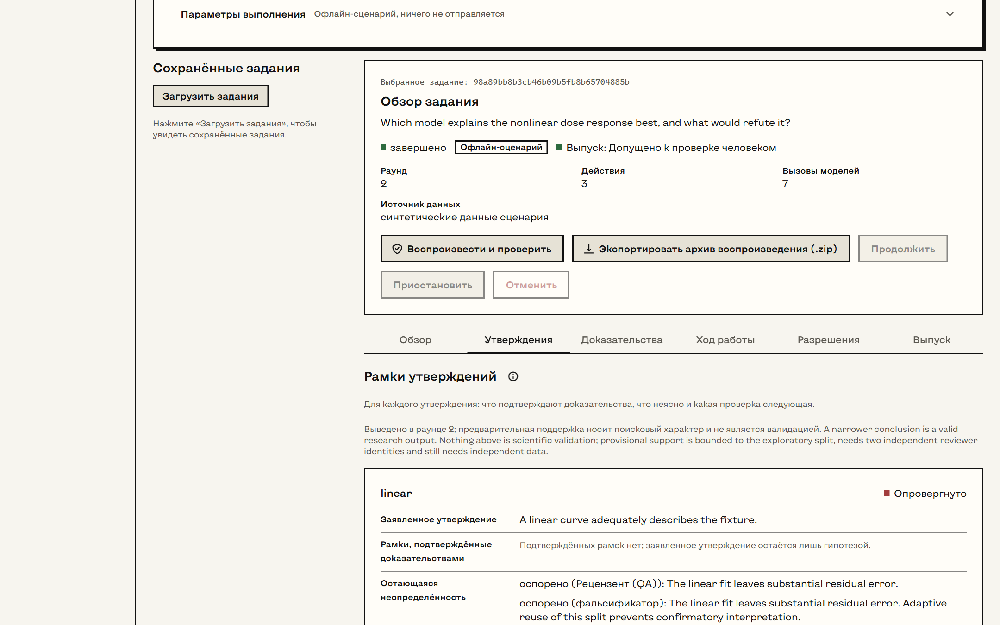
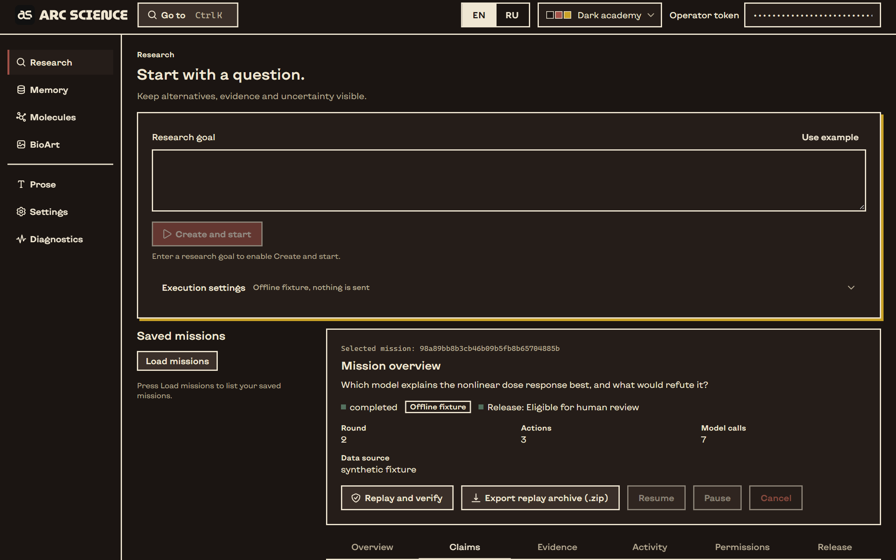

<p align="center">
  <picture>
    <source media="(prefers-color-scheme: dark)" srcset="design/logo/as/as-lockup-dark.svg">
    
  </picture>
</p>

<p align="center">Локальная исследовательская среда, в которой гипотезы, доказательства и неопределённость остаются на виду.</p>

<p align="center"><a href="README.md">English</a> | <b>Русский</b></p>

---

Arc Science ведёт исследовательские задания на вашем компьютере. Задание начинается с вопроса,
держит конкурирующие гипотезы рядом, выполняет только разрешённые вами вычисления, передаёт
результаты на проверку независимым ролям моделей и сужает каждое утверждение до того, что
подтверждают доказательства. Вокруг этого ядра — работа с молекулярными иллюстрациями
(просмотрщик Mol* и локальный рендер в Blender), импорт из NIH BioArt, память сеансов и проверка текста.



## Что это и чем это не является

- **Всё локально.** Настольное приложение запускает закрытую службу на вашем компьютере. Данные
  не уходят наружу, пока вы не одобрите маршрут задания или не подтвердите отдельный вызов;
  каждый внешний вызов записывается как разрешение и квитанция. Через API службы подтверждение
  отдельного вызова можно также запомнить на 30 дней в виде отзываемого разрешения.
- **Доказательства, а не вердикты.** В лучшем случае задание завершается статусом «можно передать
  на проверку человеку». Согласие моделей, воспроизводимость и красивые иллюстрации не считаются
  подтверждением.
- **Два языка.** Интерфейс на английском и русском, язык переключается сразу.
- **Программа в разработке.** Версия 0.6, в первую очередь для Windows. На Linux работают служба
  и её тесты; macOS не проверялась.

## Рабочие области

| | |
|---|---|
| **Исследование** | Задания: цель, гипотезы, маршрут и разрешения, хронология, область утверждений, решение о релизе, капсула для воспроизведения. |
| **Память** | Сохранённые сеансы без потерь и поиск по ним. |
| **Молекулы** | Просмотр локальных файлов координат в Mol* и рендер белых коллажей с происхождением данных. |
| **BioArt** | Поиск, просмотр и импорт из NIH BioArt; каждое сетевое действие требует отдельного согласия. |
| **Текст** | Стилистическая диагностика и бережная правка, которая не трогает факты, числа и ссылки. |
| **Настройки** | Модели ролей и учётные данные, подключения, коннекторы, оформление и язык. |
| **Диагностика** | Готовность каждого места и самой службы с объяснением причин. |

Утверждения задания, каждое суженное до того, что подтверждают доказательства:



Подробное описание каждой области — в [руководстве](docs/guide.md) (на английском).

## Последние изменения (сентябрь 2026)

Основная работа этого месяца — серверная часть нового агентного исследовательского сеанса.
Она доступна через API службы и покрыта тестами. Интерфейс сеанса, который будет её показывать
(три панели и карта решений), ещё в разработке, поэтому, если не оговорено иное, ничего
из описанного ниже в нынешней рабочей среде не отображается.

### Задания, которыми можно управлять

- **Решение после каждого плана.** С `gate: "each_round"` задание приостанавливается после каждого
  зафиксированного плана, в том числе после плана, который предлагает остановиться. Вы отвечаете
  по каждой ветви или по всему плану значением `pursue`, `park`, `drop` или `request_test`,
  при желании с заметкой, через `POST /api/missions/{id}/decisions`. Действия отложенных
  и закрытых ветвей не выполняются. Решения попадают в следующий запрос планировщика, но не
  к рецензентам, и не меняют статус утверждения. Каждое решение запечатывается в запись
  доказательств и повторно проверяется при верификации.
- **Задание в виде дерева.** `GET /api/missions/{id}/tree` возвращает планы, ветви, действия,
  наблюдения, решения и остановки, разложенные по раундам. Дерево строится при чтении
  и доказательством не является. `GET /api/missions/{id}/timeline?after=<seq>` возвращает только
  новые строки.
- **Продолжение завершённого задания.** Новое задание указывает завершённое в `continues`,
  и подтверждённая область прежнего задания становится первым элементом контекста нового.
- **Свой состав ролей.** Задание может задать свою модель и глубину рассуждения для каждой роли
  (планировщик, рецензент, оппонент, визуальная модель) вместо моделей ролей, заданных
  в Настройках. Одобренный маршрут охватывает и этот состав.
- **Прежняя работа как контекст.** К заданию можно приложить записи памяти и прежние задания
  (до 50 записей, 5 заданий и 24 000 символов), предварительно просмотрев их через
  `POST /api/missions/context/preview`. Планировщик получает этот контекст с пометкой, что это
  доказательства, которые нужно оценить, а не инструкции; разрешений такой контекст не даёт.
  Рецензентам передаются только записи памяти, написанные человеком; прежние задания и память,
  записанная заданием, идут только планировщику, чтобы оценка рецензентов оставалась
  независимой от прежнего вердикта.
- **Бюджеты.** `max_tokens`, `max_cost_usd` и `max_minutes` останавливают задание с кодом
  `token_limit`, `cost_limit` или `time_limit`. Если вызов модели не сообщил, сколько токенов
  израсходовано, задание останавливается с кодом `budget_unmeasurable`. Задание сообщает, сколько
  потрачено: токены, стоимость, вызовы и минуты. Расход проверяется перед каждым шагом модели,
  поэтому задание может выйти за бюджет на один шаг. Бюджет по стоимости работает только с моделями
  ролей, которые сообщают стоимость; сейчас это модели ролей, подключённые через Claude Code CLI.
- **Коды отказов и остановок.** Отказы маршрутов заданий, разрешений, согласия, прозы,
  настроек, проверок, памяти и BioArt имеют вид `{code, detail, facts}` с кодом из единого
  реестра `ERROR_CODES` в `error_codes.py` (маршруты рендеринга в области «Молекулы» пока
  отвечают только текстом на английском). Каждая остановка записывает `stop_code` из `STOP_CODES`
  с фактами, так что интерфейс сможет показать их на любом языке, не разбирая английский текст.
- **Задания прошлой версии работают.** Они сохраняют свои дайджесты, их можно продолжить,
  экспортировать и проверить.

### Доказательства и лестница проверки

Каждое утверждение теперь получает ступень от L0 до L5, и вычисляется она только по записанным
доказательствам. Ступень засчитывается, лишь когда выполнены все ступени ниже, а согласие между
моделями ролей её не повышает.

| Ступень | Что нужно |
|---|---|
| **L0** | Ничего: утверждение просто заявлено. |
| **L1** | Каждое число, источник и название записаны ссылкой, которая разрешается. Каждое наблюдение есть в журнале событий, у внешнего запроса есть квитанция, наблюдение выполнило запрошенное планом действие на зафиксированном наборе данных, и ни одна цитируемая работа не отозвана и не осталась непроверенной. |
| **L2** | Пройденная проверка воспроизведением, и каждое число в ссылках получено инструментом, который можно воспроизвести. |
| **L3** | Измеримый критерий опровержения (инструмент, метрика, порог, направление), зафиксированный до любого численного наблюдения набора данных. |
| **L4** | Критерий выдержал все измерения, а нулевая модель с перестановочным контролем отвергнута на уровне значимости α = 0,05. |
| **L5** | Внешняя репликация. Не реализована и всегда числится как невыполненное условие. |

- **Ссылки вместо прозы.** В новых заданиях утверждение записывает каждое число как
  `{{observation.field}}`, ссылается на поиск литературы как `{{observation}}` и помечает
  названия с цифрами как `{{name:X}}`. Смысл текста не анализируется. Цифра вне ссылки,
  в какой бы письменности она ни была, оставляет утверждение ниже L1.
- **Названия берутся из исследования.** Название разрешается, только если это же слово буквально
  есть в словаре самого исследования: в цели, в выбранных вами записях контекста (кроме
  прежних заданий и памяти, записанной моделью), в ваших заметках к решениям и в данных
  успешных наблюдений, кроме строк, повторяющих аргументы самого действия. Текст, написанный
  моделью, названий не добавляет. В записанном свободном тексте, например в аннотации, могут
  встретиться слова с единицами (24h, 10mg); они тоже считаются названиями и показываются
  вместе с местом, где исследование их записало.
- **Проверка отзыва публикаций.** Поиск литературы проверяет в OpenAlex, не отозвана ли каждая
  найденная работа; этот запрос идёт по собственному разрешению и с собственной квитанцией.
- **Релиз требует ступени.** В решении о релизе появилась проверка `claim_rungs`: L2 для
  утверждений, которые опираются на числа, L1 для остальных. Дефект в доказательствах даёт проверке
  статус failed, а ещё не сделанный шаг, например верификация, — статус unknown; в обоих случаях
  релиз заблокирован, пока утверждение не достигнет нужной ступени. Задания прошлой версии тоже
  показывают лестницу; для их экспорта отменены только требования к синтаксису ссылок, а в
  обосновании решения о релизе прямо сказано, что их числа не прослежены.
- **Что видно в рабочей среде.** Карточки утверждений в нынешней области «Исследование»
  показывают разрешённые ссылки с диагностикой и отмечают текст, на который гарантия лестницы
  не распространяется. Ступень, её условия и проверка `claim_rungs` пока не показываются.

Ступень говорит, насколько утверждение прослежено и проверено, но не говорит, что оно истинно.
Слова вокруг ссылки, например единицы измерения, лестница не проверяет.

### Память, сеть и BioArt

- **Запомненное согласие.** Проверка подключения модели, бережная правка текста, сторонняя
  детекция и сетевые запросы к BioArt принимают `remember_days: 30` вместе с флагом согласия.
  Так создаётся одно отзываемое разрешение на каждого адресата и категорию данных; каждое
  следующее использование пишет квитанцию, а новое запомненное разрешение заменяет прежнее.
  Задания таким разрешением не пользуются.
- **Системный прокси.** Все исходящие запросы (запросы к моделям ролей, проверки готовности,
  детекция текста, обращения к BioRender, HTTP-инструменты MCP, внешние запросы заданий, BioArt) идут через
  системный прокси из переменных `*_PROXY` или из «Свойств браузера» Windows. `NO_PROXY`
  и список исключений Windows учитываются, а обращения к локальному адресу идут напрямую. SOCKS-прокси
  отклоняется с сообщением, что его нужно переключить в режим HTTP.
- **BioArt снова работает.** Поиск идёт через текущий Server Action `discoverSearch` на сайте
  NIH; его идентификатор определяется во время работы. Файлы, которые NIH отдаёт без типа
  содержимого, распознаются по байтам; файлы AI импортируются как PDF, только если их принимает
  импортёр PDF; возможность предпросмотра SVG определяется отдельно от импорта. В области BioArt
  уже работают исправленные поиск, предпросмотр и импорт AI; миниатюры и коды ошибок BioArt есть
  только в API.
- **Статистика памяти.** `GET /api/memory/stats` сообщает размер базы и её WAL-файла на диске,
  объём текста до и после сжатия, число записей и то, совпадает ли полнотекстовый индекс
  с записями. Строки сеансов получили заголовок и время последнего сохранения, а ошибки
  памяти называют причину: повреждённая запись теперь возвращается как `memory.record_corrupt`.
  Область «Память» пока этого не показывает.

### Тесты

- Десять автономных сквозных тестов J0–J9 в `apps/arc-science/tests/test_session_journey.py`
  проводят новый сеанс через API на демонстрационных агентах в том порядке, в каком работал бы
  оператор: автоматический прогон, паузы для решений, закрытие ветви, бюджеты, продолжение
  завершённого задания с приложенным контекстом, состав ролей, коды отказов, задания прошлой
  версии, запомненное согласие для BioArt
  и лестница проверки.
- В четырнадцати новых файлах тестов на Python 450 тестов, а всего pytest собирает 1447.
  Полный прогон, записанный в коммите ff9e20e: 1376 тестов прошли, 71 пропущен. Движок памяти получил
  8 новых тестов на Rust.

### Что переделано

- **Разбор чисел регулярными выражениями заменён ссылками.** Первая версия лестницы сопоставляла
  числа в тексте утверждения с записанными полями через регулярные выражения и искала в тексте
  DOI и PMID. За десять коммитов с исправлениями ревью раз за разом находили формулировки,
  которые она понимала неверно (диапазоны, единицы, статистики, названия не в ASCII), поэтому её удалили
  вместе с тестами и заменили синтаксисом ссылок.
- **Названия на веру заменены словарём исследования.** Первая версия ссылок принимала любое
  `{{name:X}}`, и через проверку цифр мог пройти любой текст с цифрами. Теперь название должно
  взяться из самого исследования, его происхождение записывается, а названия в любой письменности,
  например TGF-β1, принимаются.
- **Ссылки только в своей ветви и числа, которые нельзя воспроизвести.** Ссылки разрешались
  только в ветви самого утверждения, а число результатов поиска могло дойти до L2. Теперь ссылки разрешаются по всему
  заданию, а число, которое нельзя воспроизвести, считается постоянным дефектом.
- **Задания прошлой версии вне проверки.** Они пропускали проверку ступеней. Теперь они
  проверяются, отменены только требования к синтаксису ссылок, и решение о релизе больше
  не обещает им гарантии, которой они не соответствуют.
- **Накопление запомненных разрешений.** Одновременно могло существовать несколько запомненных
  разрешений, и после отзыва видимого начинало действовать более старое, а отклонённый вызов мог
  оставить разрешение после себя. Теперь новое запомненное разрешение заменяет прежнее в той же транзакции,
  разрешение записывается только в момент отправки, а согласие на проверку модели привязано
  к реальному адресу или исполняемому файлу.
- **Пауза после остановки.** План, который предлагал остановиться, завершал задание с паузами
  без вопроса к оператору. Теперь каждый зафиксированный план ждёт вашего решения.
- **Один узел дерева на действие.** Действию, отложенному в одном раунде и продолженному
  в другом, нужны свой узел и свой исход в каждом раунде, поэтому дерево теперь рисует узел
  действия для каждого плана.
- **Неучтённый расход.** Отклонённые и неудачные вызовы моделей не шли в бюджет, а время простоя
  службы считалось временем работы. Теперь и то и другое учитывается правильно.
- **Клиенты без прокси.** BioArt, вспомогательная утилита CLI, детекция текста и HTTP-клиенты
  MCP не использовали системный прокси, а на машине разработчика NIH доступен только через него.
  Общий клиент теперь направляет каждый запрос по его собственному адресу, так что хосты из списка
  исключений идут напрямую, а дочерние процессы BioArt наследуют решение родительского процесса
  о прокси.
- **Ошибки, распознаваемые по английскому тексту.** Интерфейс переводит отказы, разбирая
  английские сообщения; коды позволят новому интерфейсу сеанса обойтись без этого. Все ошибки памяти сообщались как превышение
  бюджета чтения, а теперь называют настоящую причину, и размер базы больше не учитывает
  страницы WAL дважды.
- **EPS по текстовым догадкам.** Сменявшие друг друга текстовые эвристики для DOS-заголовка EPS
  у NIH то пропускали HTML, то отвергали настоящие файлы. Заголовок DOS EPS, который
  начинается с сигнатуры, теперь читается поле за полем, а его секции ограничены размером файла.
- **Тесты, которые молча пропускались.** Тесты SVG пропускались без растеризатора, а тесты памяти
  пропускались в CI, потому что обработчик памяти там не собирался. Теперь в обоих случаях тесты
  завершаются ошибкой с указанием причины, CI сначала собирает обработчик, а сам обработчик сообщает дайджест
  своих исходников, так что устаревшая сборка отвергается.

## Установка и запуск (Windows)

Нужны Windows 10 или 11 с WebView2, Python 3.11 или новее (проверен 3.12), Rust 1.90 и Node 22 —
только если вы пересобираете интерфейс. Blender необязателен и работает в собственной среде Python.

```powershell
git clone https://github.com/danilkotelnikov/Arc-Science.git
cd Arc-Science\apps\arc-science
python -m pip install .
cd ..\..
.\scripts\start-arc-science.ps1 -Build
```

Затем запустите `native\arc-desktop\target\release\Arc Science.exe`. Приложение хранит рабочую
папку в `%LOCALAPPDATA%\ArcScience`, при первом запуске находит Python и пакет `arc_science`,
сразу открывает окно с проверками готовности и загружает рабочую среду, когда ответит локальная
служба. Само оно ничего не устанавливает. Подробности — в [заметках о настольном приложении](native/arc-desktop/README.md)
и [описании переноса на Windows](docs/arc-science/windows-native-port-2026-09-18.md).

### Без настольной оболочки

```bash
cd apps/arc-science
python -m venv .venv && . .venv/bin/activate
python -m pip install .
arc-science serve --data ./data
arc-science token --data ./data   # токен оператора для браузера
```

Откройте http://127.0.0.1:8080/ и введите токен в шапке. Он хранится только в памяти страницы.

## Разработка

```bash
cargo build --release --locked --manifest-path native/arc-svg/Cargo.toml     # растеризатор SVG для тестов
cargo build --release --locked --manifest-path native/arc-memory/Cargo.toml  # обработчик памяти
cd apps/arc-science
python -m pip install '.[test,vector]'
python -m pytest -q -rs
cd web
npm ci
npm test          # модульные тесты и тесты DOM
npm run build     # собирает интерфейс в пакет Python
npm run e2e       # Playwright против настоящей службы
```

Тесты, которые рендерят SVG, без растеризатора завершаются ошибкой, а не пропускаются. В Windows
они сами находят `arc-svg2png.exe` из сборки выше; в других системах задайте `ARC_SVG2PNG` или
установите Cairo. Тесты обработчика памяти локально пропускаются, если он не собран; в CI им
нужна переменная `ARC_MEMORY_WORKER`, и без неё они завершаются ошибкой.

Нативные модули: `cargo test --locked` в каждой папке внутри `native/`. Логотип и значок строятся
из геометрии скриптами `scripts/build-logo.py` и `scripts/make-icon.py`
(см. [design/logo](design/logo/README.md)).

## Структура репозитория

| Путь | Содержимое |
|---|---|
| `apps/arc-science` | Служба на Python (FastAPI), рабочая среда на React в `web/` (HeroUI v3, Tailwind v4), тесты |
| `native/arc-desktop` | Настольная оболочка: окно WebView2, управление службой, диалог учётных данных |
| `native/arc-science` | Управляющая утилита: настройка, проверка, запуск обработчика |
| `native/arc-memory` | Движок памяти сеансов |
| `native/arc-svg` | Растеризатор SVG для превью и значков |
| `design` | Исходники логотипа и шрифты |
| `docs` | Руководство, инструкции, спецификация разработки и её исследовательская основа |
| `scripts` | Запуск, проверки нативных сборок, построение логотипа и значка |

## Оформление

Blockprint: чернильные контуры, прямые углы и одна смещённая тень у главного действия экрана,
восемь переключаемых палитр. Текст набран шрифтом Kyiv Type Sans, логотип — MuseoModerno Black.
Компоненты — HeroUI v3, значки — Gravity UI.



## Лицензия

Arc Science © 2026 Danil Kotelnikov. Распространяется по лицензии
[Creative Commons «Атрибуция — Некоммерческое использование — На тех же условиях» 4.0](LICENSE) (CC BY-NC-SA 4.0).

- Проект можно использовать, копировать и изменять в некоммерческих целях.
- Коммерческое использование запрещено.
- Форк или иная переработка должны указывать на этот проект (название, автора и ссылку
  https://github.com/danilkotelnikov/Arc-Science), сообщать, что изменено, и распространяться
  на тех же условиях.

Сторонние компоненты сохраняют собственные лицензии: см.
[THIRD_PARTY_NOTICES](apps/arc-science/THIRD_PARTY_NOTICES.md) и [design/fonts](design/fonts/README.md).
Копии, опубликованные до 26 сентября 2026 года, выпускались под лицензией MIT и остаются доступны
на её условиях. Creative Commons не рекомендует свои лицензии для программ; CC BY-NC-SA выбрана
сознательно — ради условий о некоммерческом использовании и распространении на тех же условиях.
