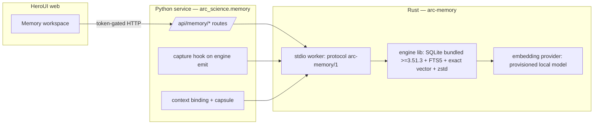

# Native Session Memory

This design turns the researched [session-memory proposal](native-session-memory-proposal-2026-09-11.md)
into an approved, buildable implementation. It fixes the two decisions the proposal
left open: the engine is **Rust-first** (`arc-memory`), and the first qualification
target is **Windows-native**. Everything the proposal marked as a contract, boundary
or acceptance requirement is retained; nothing here weakens it.

## 1. Goal

Give Arc a project-local record of the harness's own session history — planning
rounds, model invocations, analyst/falsifier reconciliations and tool observations —
captured continuously, **retained across context compaction**, stored **heavily
compressed at rest**, and searchable **instantly** by both keyword and meaning. The
agentic UI can reach any span of any past session (compressed or not) so the model
can reason over its own trajectory to improve reasoning, fact-checking and
accountability.

This is agent-side persistent memory. It is **not** a change to model weights, and
**not** a way to load unlimited history into a context window. Retrieved, bounded
passages become ordinary model input; the original text and its provenance remain
available separately.

## 2. Scope and non-goals

In scope:
- A new Rust engine crate `arc-memory` plus a long-lived stdio worker.
- A Python client (`arc_science.memory`) and token-gated `/api/memory/*` service routes.
- A HeroUI **Memory** workspace.
- Continuous capture from the exploration engine, including compaction handling.
- Hybrid (lexical + vector) scoped retrieval with provenance and abstention.
- Replay binding so retrieved context is reproducible.

Explicit non-goals (unchanged from the proposal):
- Does **not** replace or migrate `MissionRepository` (`exploration/repository.py`)
  or the hash-chained `EventLedger` (`store.py`). Memory is a *parallel* store.
- Does **not** grant memory any authority: retrieved content is untrusted data, never
  instructions. Memory cannot change tools, permissions, network consent, evaluator
  thresholds, or Harness-of-Harness roles.
- Does **not** import arbitrary files, other projects, browser history, or external
  session transcripts by default. Arc-owned session events first; any external import
  (including a MemPalace export) is a separate, explicit, opt-in step and never mutates
  the user's original store.
- Does **not** establish scientific validity. A retrieved passage is not a verified
  fact; a summary never replaces its original.

## 3. Environment reality (verified 2026-09-16)

| Tool | Present | Consequence for this design |
|---|---|---|
| rustc / cargo | 1.93.1 | Rust-first is viable natively; edition 2024 + the existing crate's `rust-version = 1.90` are satisfied. |
| Python | 3.11.9 | Meets `requires-python = ">=3.11"`. |
| **Python bundled SQLite** | **3.45.1** | **Below the proposal's required ≥ 3.51.3 (WAL-reset fix).** `arc-memory` therefore **bundles its own SQLite ≥ 3.51.3** through `rusqlite`'s bundled build and does not use Python's `sqlite3` for the memory database. |
| node | 24.14 | Sufficient for the HeroUI/Vite build. |
| Existing native crate | `native/arc-science` | Already a process supervisor built with `process-wrap` + the `job-object` feature — the memory worker inherits clean Windows child-tree lifecycle from it. |

Target triple for qualification: `x86_64-pc-windows-msvc`. macOS/Linux native runs
follow; cross-compilation and WSL are not substitutes for a Windows-native test.

## 4. Architecture

Three layers, each independently testable:

- **Rust `arc-memory`** owns the database, compression, indexing and retrieval. It is
  the authoritative store for memory (separate DB file from `missions.db`).
- **Python `arc_science.memory`** is a thin client that speaks the stdio protocol,
  plus the FastAPI routes and the capture/binding glue into `exploration/`.
- **HeroUI Memory workspace** is a read/inspect/retention surface, same operator-token
  gate as the BioArt workspace.

The Python service never reimplements retrieval; it delegates to the worker so there is
one implementation of scoring, fusion and provenance.

## 5. Native crate layout

Convert `native/` into a Cargo **workspace** with members:

- `native/arc-science` — existing supervisor (unchanged behaviour).
- `native/arc-memory` — library crate: schema, records, compression, FTS5, vector
  index, embedding provider trait, retrieval.
- `native/arc-memory` also ships a `bin` (the stdio worker) behind a small `main.rs`,
  or a sibling `native/arc-memory-worker` bin crate — decided at implementation start;
  the library is the unit that carries the tests either way.

Dependencies (exact versions pinned against current docs at implementation time, per
house rule; not asserted from memory here):
- `rusqlite` with `bundled` (SQLite ≥ 3.51.3) and the FTS5 feature.
- `zstd` for at-rest compression of original text.
- `serde` / `serde_json` for the wire protocol and record encoding.
- An embedding runtime (`fastembed`/`ort` ONNX or equivalent) used only with an
  **explicitly provisioned, pinned local model** and **offline startup** — never a
  silent download on a query.
- Exact cosine scan is the baseline vector search. An approximate engine (USearch
  HNSW, or LanceDB) is a later, benchmarked generation behind the same trait; it is
  not adopted without a recall comparison.

The worker is launched by the existing supervisor so it gets `job-object` child-tree
termination on Windows.

## 6. Worker protocol (`arc-memory/1`)

Transport: length-prefixed JSON over stdio, one long-lived worker per data directory
(the proposal's single-worker model). The protocol is **versioned**; an unknown version
is refused, not guessed.

Operations (request → response, all responses carry provenance where applicable):
- `health`, `stats` — readiness, generation ids, index lag, counts, RSS/disk.
- `append(record)` — idempotent by content+key; commits the immutable event and an
  embedding work-item in one transaction; returns the record digest.
- `search(scope, query, budget)` — scoped hybrid retrieval; returns hits with source
  spans, hashes, retrieval reason, trust labels; **may return empty (abstention)**.
- `inspect(record_id | digest)` — full record + provenance, optionally decompressed.
- `session_list(scope)` — sessions with their compaction epochs.
- `session_fetch(session_id, range, compressed?)` — any span of a past session,
  compressed or decompressed, for the UI's "reach any part" requirement.
- `disable(selector)` / `erase(selector, approval)` — the two deletion verbs (§10).
- `export(scope)` — backup via SQLite's backup API (never a live-WAL file copy).

Errors are typed and never leak secrets. Backpressure: `append` enqueues embedding
work; `search` always includes a bounded exact-search tail or explicitly reports
indexing lag rather than returning a silently partial result.

## 7. Data model

Records mirror `contracts.py` discipline (canonical JSON, sha256 digests, frozen
semantics). SQLite tables in `memory.db`; original text stored zstd-compressed as
content-addressed blobs.

- **MemoryRecord**: `project_id`, `session_id`, `agent_id`, `seq`, `role`
  (`user` | `assistant` | `planner` | `falsifier` | `reconciliation` | `tool` | `system`),
  wall time + monotonic seq, **content digest of the original UTF-8 (stored
  compressed)**, `source_uri` or `artifact_digest`, **`trust_category`**
  (`model_output` | `operator` | `public_snapshot` | `tool_observation`), `visibility`,
  `retention_state`, and **`compaction_epoch`**.
- **Chunk**: parent record digest, exact byte span `(start,end)` into the original,
  chunk text digest; deterministic chunking with bounded overlap.
- **Embedding**: chunk digest, `model_id` + tokenizer/weights hashes, `dim`,
  `normalization`, `metric`, `pipeline_version`, `generation_id`, canonical `f32`
  vector. Rejects NaN/inf, wrong dimension, and unusable zero vectors. **Mixed
  embedding spaces never share a searchable generation**; a model switch builds a new
  generation explicitly.
- **Derived** (summaries/extracted facts, later): separate records that never replace
  the original and never become verified facts by retrieval.

Compression note ("hardly compressed" = heavily compressed): originals are stored at a
high zstd level; the FTS index and the vector generation stay warm/uncompressed so
search is instant and spans decompress on demand.

## 8. Capture and compaction

- **Capture**: hook the exploration engine's `emit` path (`exploration/engine.py`) so
  each planning round, model invocation, reconciliation and tool observation appends a
  `MemoryRecord`. Capture is append-only and additive; it does not alter mission state.
- **Compaction**: whenever the harness compacts context, write a compaction event
  advancing `compaction_epoch` N → N+1 **plus the full pre-compaction transcript,
  compressed**, so nothing is lost and every epoch remains reachable. Post-compaction
  work keeps appending under the new epoch.
- **Durability**: one transaction commits the immutable event and its embedding
  work-item; a worker crash leaves a resumable queue; a derived index publishes a
  generation only after its file, checksum and DB high-water mark agree.

## 9. Retrieval

- **Scope first**: project/session/agent authorization is applied **before** candidate
  selection. A caller-supplied scope string is not an access grant.
- **Hybrid**: FTS5 lexical matches fused with vector neighbours (exact cosine
  baseline). Fusion, tie-breaking and token budgets are deterministic and versioned.
- **Adjacency**: a hit can expand to its neighbouring original messages.
- **Abstention**: when nothing relevant exists, return empty rather than a weak hit.
- **Provenance**: every hit carries source span, hash, retrieval reason and trust label.

## 10. Replay and context binding

- Extend `exploration/evidence.py` binding and the capsule (`exploration/capsule.py`)
  so that when memory feeds a model call, the context compiler records the selected
  record ids, exact passage hashes, query hash, model/index generation, scope,
  scoring-policy version and truncation into the mission invocation context.
- **Replay uses the frozen retrieved passages**, not today's changing nearest
  neighbours. A memory outage is visible; resuming a run cannot silently alter its
  context.
- These binding checks are extended and regression-tested **before** memory output
  reaches any model call.

## 11. Deletion and retention

Two clearly named operations, with honest limits stated in UI and API before either
runs:
- **Remove from future retrieval** (`disable`) — tombstones records so current queries
  exclude them (even if an older index still holds their vector); already-frozen
  mission evidence stays intact.
- **Erase stored content** (`erase`) — an enumerated, approved purge across memory
  records, retained invocation passages, and locally managed exports. Purging evidence
  **invalidates affected replay/certification and records that loss** rather than
  keeping a passing receipt. Copies outside Arc's control cannot be promised erased.

The word "forget" alone is never used as an operation.

## 12. Security and privacy

- Retrieved content is untrusted data; the binding layer treats it as such.
- Local-only by default. Cloud embeddings require a separate destination/consent
  decision and are off by default.
- No credentials or secrets are stored in memory records or telemetry. Secret
  screening on ingestion is defense in depth, not a guarantee that arbitrary
  transcripts are safe — which is why external import stays opt-in.
- All `/api/memory/*` routes require the operator bearer token, like BioArt.

## 13. API and UI surface

- **Routes** (`arc_science.memory` + `service.py`): `search`, `inspect`,
  `session_list`, `session_fetch` (compressed/uncompressed), `export`, `disable`,
  `erase`, `stats`. `append` is worker-internal (driven by capture), not a public route.
- **Memory workspace** (HeroUI): browse sessions and their compaction epochs; combined
  full-text + semantic search; inspect a record with its full provenance; jump to any
  span of any past session; retention controls with the §11 boundary shown before
  action.

## 14. Testing and acceptance

Retained from the proposal, plus one runnable self-check per non-trivial unit:

- Crash/restart and interrupted-ingestion; idempotent append; no event loss after an
  acknowledged durable write; recoverable index rebuilds and migrations.
- Cross-project and private-agent isolation; malformed vectors; duplicate ids;
  prompt-injection records; secret handling; deletion visibility.
- **Stable context replay**: memory cannot fabricate a citation, satisfy an obligation,
  certify a figure, or relax an acceptance rule.
- **Real embedding tests kept separate from synthetic-vector tests** — no semantic-
  quality claim from random vectors or keyword-only fixtures.
- Exact-vs-ANN recall on 10k/100k synthetic vectors; scoped realistic queries;
  held-out session questions. Retrieval recall, answer correctness, temporal updates
  and abstention are measured as different metrics.
- Latency measured separately (cold start, warm p50/p95/p99, embedding time, retrieval
  time, full context assembly, ingestion throughput, RSS, disk, binary size). Proposed
  target: retrieval-only p95 < 20 ms at 100k × 384-dim on a declared reference machine
  — a **target, not a measured result**, excluding query embedding and LLM generation.
- **Native execution on Windows first**, then macOS and Linux. Compile checks alone do
  not qualify filesystem, model-library or IPC behaviour.

## 15. Milestones

Each milestone lands with red/green tests and is independently reviewable.

| # | Deliverable | Acceptance evidence |
|---|---|---|
| M0 | Cargo workspace; `arc-memory` skeleton; CI wiring | `cargo test`/`clippy` green on Windows; existing `arc-science` crate unaffected |
| M1 | Engine core: schema, append, exact search, zstd, records/chunks | Idempotent append, crash/restart, isolation, deletion-visibility tests |
| M2 | Embedding provider: provisioned local model, generation model | Real-embedding tests separate from synthetic; offline-startup test; malformed-vector rejection |
| M3 | Stdio worker + `arc-memory/1` protocol | Protocol conformance; unknown-version refusal; backpressure/lag reporting |
| M4 | Python client + `/api/memory/*` + capture hook + compaction | Capture-on-emit, compaction epoch retention, scoped retrieval through the service |
| M5 | Replay/context binding extension | Frozen-passage replay; outage visibility; binding regression tests |
| M6 | HeroUI Memory workspace | UI tests; session/epoch browse; provenance inspect; retention guardrails |
| M7 | Windows-native qualification + acceptance suite | Recall/latency measurements (as targets), Windows-native run evidence |

## 16. Open decisions (deferred, do not block start)

- Default local embedding model (compact English vs multilingual) — decided at M2 with
  a small comparison; both provisioned explicitly.
- Approximate vector engine (USearch vs LanceDB) — evaluated after the exact baseline,
  adopted only on a recall/latency win.
- External transcript import (Claude Code / ChatGPT / MemPalace export) — opt-in
  adapter to the same contract, scheduled after the Arc-owned path is qualified.
- Exact crate versions — pinned at implementation time against current documentation.
